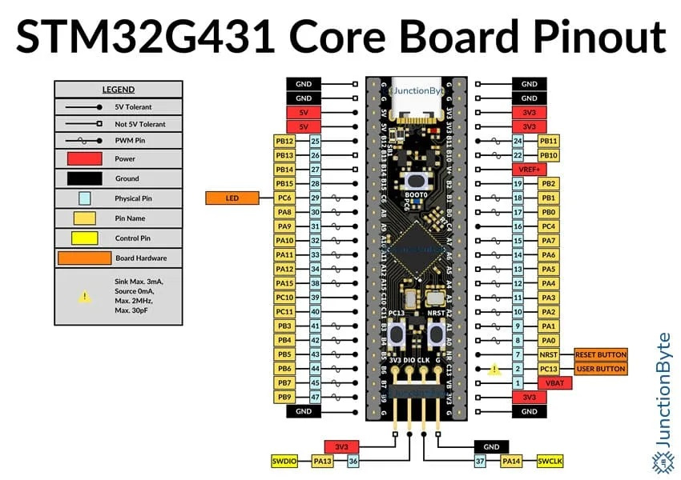

# Quick reference for the WeAct Studio STM32G431Core

## STM32G431Core Pinout 




## Delay and Timing
Use the `time` module:

```v
import time

time.sleep(2)            // sleep for 2 seconds
time.sleep_ms(50)        // sleep for 50 milliseconds
time.sleep_us(100)       // sleep for 100 microseconds
```

### Functions
| name                  | description           |
| --------------------- | --------------------- |
| `time.sleep(time)`    | Delay in seconds      |
| `time.sleep_us(time)` | Delay in microseconds |
| `time.sleep_ms(time)` | Delay in milliseconds |


## Onboard Hardware
The onboard LED is named `led0` 

```v
import pin

pin.setup(led0, pin.output)
pin.high(led0)
```


## Pin module
Use the `pin` module:

```v
import pin

pin.setup(pin.pa0, pin.input)
pin.high(pin.pc6)
pin.low(pin.pa3)
pin.write(pin.pa8, pin.read(pin.pa0)) // pin echo
```

### Functions
| name                    | description               |
| ----------------------- | ------------------------- |
| `pin.setup(pin, mode)`  | Configure `pin` as `mode` |
| `pin.high(pin)`         | Turn On `pin`             |
| `pin.low(pin)`          | Turn Off `pin`            |
| `pin.write(pin, value)` | Write `value` in `pin`    |
| `pin.read(pin)`         | Return the state of `pin` |


### Digital pin names
| Pin | STM32 Pin | Macro Value |
| --- | --------- | ----------- |
| d0  | pa0       | 192         |
| d1  | pa1       | 193         |
| d2  | pa2       | 194         |
| d3  | pa3       | 195         |
| d4  | pa4       | 196         |
| d5  | pa5       | 197         |
| d6  | pa6       | 198         |
| d7  | pa7       | 199         |
| d8  | pa8       | 8           |
| d9  | pa9       | 9           |
| d10 | pa10      | 10          |
| d11 | pa11      | 11          |
| d12 | pa12      | 12          |
| d13 | pa15      | 13          |
| d14 | pb3       | 19          |
| d15 | pb4       | 20          |
| d16 | pb5       | 21          |
| d17 | pb6       | 22          |
| d18 | pb7       | 23          |
| d19 | pb8       | 44          |
| d20 | pb9       | 25          |
| d21 | pb10      | 26          |


## Pin port module
Use the `port` module:

```v
import port

port.setup(port.b, port.all_outputs)
port.setup(port.c, port.all_inputs)  // port A bit 7 and 6 as outputs, the rest as inputs

val := port.read(port.c)
port.write(port.b, val) // port echo
```

### Functions
| name                      | description                |
| ------------------------- | -------------------------- |
| `port.setup(port, mode)`  | Configure `port` as `mode` |
| `port.read(port)`         | Return the value of `port` |
| `port.write(port, value)` | Write `value` to `port`    |

### Digital port names
| Port  | Aixt name |
| :---: | :-------: |
| **B** |    `b`    |
| **A** |    `a`    |
| **C** |    `c`    |


## PWM (Pulse Width Modulation)
Use the `pwm` module:

```v
import pwm

pwm.write(pwm.ch0, 40)       // set the duty cycle for PWM channel 0
pwm.write(pwm.ch1, 60)       // set the duty cycle for PWM channel 1
```

### Functions
| name                        | description                        |
| --------------------------- | ---------------------------------- |
| `pwm.write(channel, value)` | Write `value` in the PWM `channel` |

### PWM pin names
The PWM channels are named from `ch0` to `ch5`.


## ADC (Analog to Digital Converter)
Use the `adc` module:

```v
import adc

val1 := adc.read(ch0)       // read de ADC channel 0
val2 := adc.read(ch1)       // read de ADC channel 1
```

### Functions
| name                | description                       |
| ------------------- | --------------------------------- |
| `adc.read(channel)` | Return the ADC value in `channel` |

### Analog channels
The PWM channels are named from `ch0` to `ch7`.


## UART (serial port)
Use the `uart` module:

```v
import uart

uart.print('Hello ')
uart.println('World...')
```

### Functions
| name                    | description                                                    |
| ----------------------- | -------------------------------------------------------------- |
| `uart.setup(baud_rate)` | Configure the `baud_rate` of the UART                          |
| `uart.read()`           | Return one character received by UART                          |
| `uart.input(message)`   | Send the `message` and then return the string received by UART |
| `uart.write(character)` | Send one character by UART                                     |
| `uart.print(message)`   | Send the `message` by UART                                     |
| `uart.println(message)` | Send the `message` plus a new line by UART                     |
| `uart.any()`            | Return the number uf characters in the UART's buffer           |


## Examples

### LED Blinking
```v
import time
import pin

pin.low(led0)	// turn off the on-board LED

for {
	pin.toggle(led0)    // LED toggle 
	time.sleep_ms(500)  // delay
}

```

### ADC value sent by UART
```v
import time
import uart
import adc

uart.setup(9600)

for {
	analog := adc.read(adc.ch0)
	uart.println('ADC channel 0: ${analog}')
	time.sleep_ms(1000)
}
```

### LED Blinking by Interrupt
```v
import pin
import ext

__global (
	state = true
)

@[ext_isr: 'pin.pc13']
fn blink() {
	state = !state
}

fn main() {
	pin.setup(pin.pc13, pin.in_pulldown)
	pin.setup(pin.pa8, pin.output)
	pin.high(pin.pa8)

	ext.irq_enable(pin.pc13, ext.rising)

	for {
		pin.write(pin.pa8, u8(state))
	}
}
```
